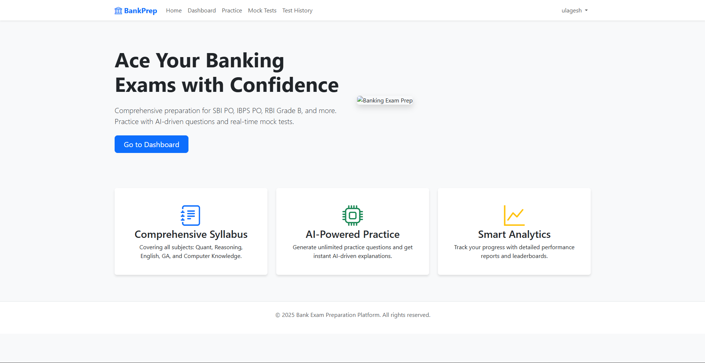

# 🎓 AI-Powered Banking Exam Preparation Platform

<div align="center">
  
  
  
  **Infinite, high-quality exam preparation powered by Generative AI**
  
  [](https://djangoproject.com)
  [](https://python.org)
  [](https://ai.google.dev)
  [](https://getbootstrap.com)
  
</div>

---

## 🚀 Project Overview

An innovative Django-based EdTech platform that revolutionizes Indian banking exam preparation through AI-powered content generation. Unlike traditional platforms with static question banks, this system **generates fresh, exam-grade content on demand** - creating an infinite practice resource that never repeats.

### 🎯 Target Exams
- **RRB** (Clerk/PO) - Regional Rural Banks
- **SBI** (Clerk/PO) - State Bank of India  
- **IBPS** (Clerk/PO) - Institute of Banking Personnel Selection

### 💡 The Game Changer

This isn't just a question generator - it's an intelligent exam simulation system:

- 🧠 **Structured Intelligence**: Generates not just text, but complete data structures (charts, tables, graphs) that the frontend can visualize
- 🎯 **Exam-Accurate**: Hardcoded topic distributions ensure each mock test mirrors real exam patterns exactly
- 🧩 **Context-Aware**: Creates grouped question sets where one puzzle/chart supports multiple questions (just like real exams)
- ⚡ **On-Demand Generation**: Dynamically creates 80-100 fresh questions for full mock tests
- 📊 **Smart Analytics**: Tracks accuracy, skipped questions, and provides AI-generated explanations for every answer

---

## ✨ Key Features

### 🤖 AI-Powered Content Engine

**Smart Generation**
- Creates structured JSON objects for Data Interpretation (tables, bar graphs, line charts)
- Generates complete question sets with context (puzzles, reading comprehension passages)
- Produces detailed explanations for every answer automatically

**Context Management**
- Handles "grouped questions" authentically (one puzzle text → five related questions)
- Mirrors real exam patterns where multiple questions share common data
- Efficient storage: one context, multiple questions

**Built-in Resilience**
- Custom JSON parser (`extract_json_substring`) handles malformed AI responses
- Automatic retry logic ensures stable operation even with API fluctuations
- Error handling prevents crashes from AI inconsistencies

### 📝 Full Mock Test Simulation

**Authentic Exam Experience**
- Complete exam structure with multiple timed sections
- Section-wise time limits (e.g., Reasoning: 20 mins, Quant: 20 mins)
- Real exam difficulty levels (Prelims/Mains)

**Comprehensive Tracking**
- Score calculation with detailed breakdowns
- Accuracy metrics (correct vs. incorrect vs. skipped)
- Time management analytics per section
- Full attempt history with performance trends

**Models**
- `MockTest`: Complete exam papers
- `TestSection`: Individual sections with time limits
- `UserTestAttempt`: Performance tracking and analytics

### 📚 Practice & Study Modules

**Topic-Wise Drills**
- Practice specific weak areas in isolation
- Choose from 30+ topics across all subjects
- Progressive difficulty levels

**Organized Content**
- Questions categorized by `Subject` and `Topic`
- Thousands of AI-generated questions in the database
- Easy filtering and search functionality

**Study Resources**
- Concept explanations for each topic
- Formula sheets and quick reference guides
- Tips and tricks from expert curators

---

## 🛠️ Technology Stack

```
Backend:        Django 5.2.8 (Python) 🎯
Database:       SQLite (Django ORM) 💾
AI Models:      Google Gemini 2.0 Flash Exp 🤖
Frontend:       Django Templates 📄 | Bootstrap 5 🎨
Forms:          django-crispy-forms 📝
Environment:    Windows (Local Development) 💻
```

---

## 📂 Project Architecture

```
banking-exam-platform/
│
├── ai_engine/                    # 🧠 Core AI Intelligence
│   ├── ai_service.py            # Gemini integration
│   ├── prompts.py               # Specialized AI prompts per topic
│   ├── utils.py                 # JSON extraction & retry logic
│   ├── parsers.py               # extract_json_substring parser
│   └── config.py                # AI model configurations
│
├── tests/                        # 📝 Mock Test Management
│   ├── models.py                # MockTest, TestSection, UserTestAttempt
│   ├── views.py                 # Test delivery & submission handlers
│   ├── admin.py                 # Admin interface for test creation
│   ├── utils.py                 # Scoring algorithms
│   └── templates/
│       ├── test_list.html       # Available mock tests
│       ├── test_attempt.html    # Test-taking interface
│       └── test_result.html     # Detailed scorecard
│
├── practice/                     # 🎯 Practice Questions Module
│   ├── models.py                # Question, QuestionGroup
│   ├── views.py                 # Practice session handlers
│   ├── generation/              # Question generation scripts
│   │   ├── generate.py          # Batch generation logic
│   │   └── validators.py        # Quality checks
│   └── templates/
│       ├── practice_home.html   # Topic selection
│       └── practice_quiz.html   # Question interface
│
├── study/                        # 📚 Study Materials
│   ├── models.py                # StudyNote, ConceptExplanation
│   ├── views.py                 # Content delivery
│   └── templates/
│       └── study_material.html
│
├── exams/                        # 🏛️ Exam Structure & Taxonomy
│   ├── models.py                # Exam, Subject, Topic hierarchy
│   ├── admin.py                 # Exam configuration interface
│   └── distributions.py         # Hardcoded exam topic distributions
│
├── core/                         # ⚙️ Project Core
│   ├── settings.py              # Django configuration
│   ├── urls.py                  # Main URL routing
│   └── middleware.py            # Custom middleware
│
├── static/                       # 🎨 Frontend Assets
│   ├── css/
│   │   ├── main.css             # Global styles
│   │   └── exam.css             # Test interface styles
│   ├── js/
│   │   ├── timer.js             # Countdown timer
│   │   ├── charts.js            # Data visualization
│   │   └── quiz.js              # Question navigation
│   └── img/
│       └── charts/              # Generated chart images
│
├── templates/                    # 🖼️ Global Templates
│   ├── base.html                # Base template
│   ├── navbar.html              # Navigation
│   └── footer.html
│
├── manage.py                     # Django management script
├── requirements.txt              # Python dependencies
├── .env.example                  # Environment variables template
└── README.md
```

---

## 🚀 Quick Start

### Prerequisites

```bash
Python 3.8 or higher
pip (Python package manager)
Gemini api Key (for AI generation)
```

### Installation

1. **Clone the repository**
   ```bash
   git clone https://github.com/yourusername/banking-exam-platform.git
   cd banking-exam-platform
   ```

2. **Create virtual environment**
   ```bash
   python -m venv venv
   
   # Activate (Windows)
   venv\Scripts\activate
   
   # Activate (macOS/Linux)
   source venv/bin/activate
   ```

3. **Install dependencies**
   ```bash
   pip install -r requirements.txt
   ```

4. **Set up environment variables**
   ```bash
   # Create .env file
   copy .env.example .env  # Windows
   # or
   cp .env.example .env    # macOS/Linux
   
   # Edit .env and add your API key
   GEMINI_API_KEY=your_api_key_here
   ```

5. **Run migrations**
   ```bash
   python manage.py makemigrations
   python manage.py migrate
   ```

6. **Create superuser**
   ```bash
   python manage.py createsuperuser
   ```

7. **Load initial data (optional)**
   ```bash
   python manage.py loaddata exams/fixtures/initial_exams.json
   python manage.py loaddata exams/fixtures/subjects_topics.json
   ```

8. **Generate sample questions**
   ```bash
   python manage.py shell
   >>> from practice.generation.generate import generate_questions_batch
   >>> generate_questions_batch(exam='RRB_CLERK', subject='Reasoning', count=50)
   ```

9. **Run development server**
   ```bash
   python manage.py runserver
   ```

10. **Access the platform**
    - Main site: `http://127.0.0.1:8000/`
    - Admin panel: `http://127.0.0.1:8000/admin/`

---

## 🎮 How It Works

### Content Generation Flow

```
User Request → Topic Selection → AI Prompt Construction
                                          ↓
                                  Gemini API Call
                                          ↓
                        JSON Response (with retry logic)
                                          ↓
                            Custom Parser & Validation
                                          ↓
                        Database Storage (Question/QuestionGroup)
                                          ↓
                              Display to User
```

### Example: Generating Data Interpretation Questions

**AI Output Structure:**
```json
{
  "question_group": {
    "chart_type": "bar",
    "chart_data": {
      "title": "Sales Performance 2019-2023",
      "labels": ["2019", "2020", "2021", "2022", "2023"],
      "datasets": [
        {
          "label": "Product A",
          "data": [45000, 52000, 61000, 58000, 67000]
        },
        {
          "label": "Product B",
          "data": [38000, 41000, 39000, 45000, 51000]
        }
      ]
    }
  },
  "questions": [
    {
      "question_text": "What is the percentage increase in sales of Product A from 2019 to 2023?",
      "option_a": "48.89%",
      "option_b": "52.45%",
      "option_c": "44.23%",
      "option_d": "49.56%",
      "option_e": "46.67%",
      "correct_answer": "A",
      "explanation": "Sales increased from 45000 to 67000. Percentage increase = ((67000-45000)/45000) × 100 = 48.89%"
    },
    // ... 4 more questions based on same chart
  ]
}
```

### Exam-Specific Topic Distribution

**Example: RRB Clerk Prelims (Hardcoded in `exams/distributions.py`)**
```python
RRB_CLERK_PRELIMS = {
    'Reasoning Ability': {
        'Puzzles & Seating Arrangement': 10,
        'Syllogism': 3,
        'Inequality': 3,
        'Coding-Decoding': 4,
        'Total': 35
    },
    'Quantitative Aptitude': {
        'Data Interpretation': 10,
        'Number Series': 5,
        'Simplification': 10,
        'Approximation': 5,
        'Total': 40
    },
    'Total Questions': 80,
    'Total Time': 45  # minutes
}
```

---

## 📊 Core Capabilities

### 1. Dynamic Mock Test Generation

Generate complete 80-100 question exams on the fly:

```python
# In Django shell or management command
from tests.utils import generate_full_mock_test

mock_test = generate_full_mock_test(
    exam_type='RRB_CLERK',
    level='PRELIMS',
    test_number=1
)
# Creates: 1 MockTest, 3 TestSections, 80 Questions
```

### 2. Topic-Wise Practice

Users can drill down on weak areas:

```python
# Practice only "Number Series" from Quantitative Aptitude
questions = Question.objects.filter(
    subject__name='Quantitative Aptitude',
    topic__name='Number Series'
).order_by('?')[:20]  # Random 20 questions
```

### 3. Detailed Analytics

Every test attempt stores:
- Total score and percentage
- Subject-wise breakdown
- Time taken per section
- Question-wise correct/incorrect/skipped status
- Comparison with average performance

### 4. AI-Generated Explanations

Every question includes a detailed explanation:

```python
# If explanation doesn't exist, generate on-demand
if not question.explanation:
    from ai_engine.ai_service import generate_explanation
    question.explanation = generate_explanation(question)
    question.save()
```

---

## 🧩 Complex Question Handling

### Grouped Questions (Puzzles, DI)

**Database Model:**
```python
class QuestionGroup(models.Model):
    context_type = models.CharField(max_length=50)  # 'puzzle', 'chart', 'passage'
    context_text = models.TextField()  # The puzzle text or passage
    chart_data = models.JSONField(null=True)  # For DI questions
    
class Question(models.Model):
    group = models.ForeignKey(QuestionGroup, null=True)
    question_text = models.TextField()
    # ... options, answer, explanation
```

**Benefits:**
- One puzzle stored → Five questions linked
- Efficient database usage
- Authentic exam experience
- Easy frontend rendering

---

## 🗺️ Roadmap

### ✅ Completed
- [x] AI-powered question generation engine
- [x] Full mock test simulation with timing
- [x] Grouped question support (DI, Puzzles)
- [x] User authentication and progress tracking
- [x] Bootstrap 5 responsive interface
- [x] Admin panel for content management

### 🚧 In Progress
- [ ] Advanced performance analytics dashboard
- [ ] Mobile app (React Native)
- [ ] Video explanations for complex topics

### 📋 Planned
- [ ] Adaptive difficulty (AI adjusts based on performance)
- [ ] Peer comparison and leaderboards
- [ ] PDF report generation for test results
- [ ] Multi-language support (Hindi, regional languages)
- [ ] Payment gateway integration (premium features)
- [ ] Doubt resolution forum
- [ ] Live mock tests with rankings
- [ ] WhatsApp bot for daily practice questions

---

## 🔧 Configuration

### AI Model Settings

Edit `ai_engine/config.py`:

```python
AI_CONFIG = {
    'model': 'google/gemini-2.0-flash-exp:free',
    'temperature': 0.7,        # Controls randomness (0-1)
    'max_tokens': 2000,        # Maximum response length
    'retry_attempts': 3,       # Retry count for failed requests
    'batch_size': 5            # Questions per AI call
}
```

### Exam Topic Distributions

Edit `exams/distributions.py` to modify question counts:

```python
TOPIC_DISTRIBUTION = {
    'RRB_CLERK_PRELIMS': {
        'Reasoning': {
            'Puzzles': 10,
            'Seating Arrangement': 5,
            'Syllogism': 3,
            # ... more topics
        },
        'Quantitative': {
            'DI': 10,
            'Number Series': 5,
            # ... more topics
        }
    }
}
```

---

## 🐛 Troubleshooting

### AI Generation Errors

**Problem**: Questions not generating
```bash
# Check API key
python manage.py shell
>>> import os
>>> print(os.getenv('GEMINI_API_KEY'))


**Problem**: Malformed JSON responses
- The system has built-in retry logic (3 attempts)
- Check `ai_engine/parsers.py` - `extract_json_substring` handles most cases
- If persistent, reduce `temperature` in config

### Database Issues

**Problem**: Migration errors
```bash
# Reset database (WARNING: Deletes all data)
python manage.py flush
python manage.py migrate
```


### Performance Issues

**Problem**: Slow question generation
- Reduce `batch_size` in AI config
- Implement caching for frequently requested topics
- Consider background task queue (Celery) for large batches

---

## 🤝 Contributing

Contributions are welcome! Areas where you can help:

- 🎨 UI/UX improvements
- 🧪 Test coverage
- 📝 Documentation
- 🐛 Bug fixes
- 🚀 Performance optimization
- 🌐 Internationalization

### How to Contribute

1. Fork the repository
2. Create feature branch (`git checkout -b feature/AmazingFeature`)
3. Commit changes (`git commit -m 'Add AmazingFeature'`)
4. Push to branch (`git push origin feature/AmazingFeature`)
5. Open a Pull Request

---


---

## 🙏 Acknowledgments

- **Google Gemini** for powerful language models
- **Django Community** for excellent framework and docs
- **Bootstrap Team** for responsive UI components
- **Banking Exam Aspirants** for valuable feedback

---

## 📧 Contact
**Project Maintainer**

- Email: ulageshofficial@gmail.com
- LinkedIn: [linkedin.com/in/ulageshwaran](https://linkedin.com/in/ulageshwaran)
- GitHub: [@ulageshwaran](https://github.com/ulageshwaran)
---
<div align="center">
  
  **Built with 🧠 AI and ❤️ for Banking Exam Aspirants**
  
  *"Education is the most powerful weapon which you can use to change the world."* - Nelson Mandela
  
  ⭐ Star this repo to support AI-powered education!
  
</div>
